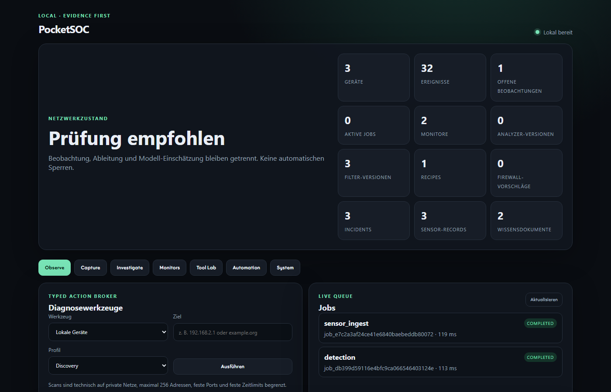

# PocketSOC

PocketSOC is a local, evidence-first defensive network workbench for a workstation or an explicitly authorized private LAN. It turns bounded Wireshark evidence and local host observations into reviewable incidents without sending traffic to a cloud model.



It is deliberately not a free shell agent and not a replacement for Suricata, Zeek or a production SIEM. Collection, deterministic detection, knowledge retrieval, model language and reviewed response are separate trust boundaries.

## Why PocketSOC

- **Private by default:** loopback-only web service, local SQLite/WAL and optional local Ollama.
- **Evidence before AI:** deterministic facts remain usable without a model; model output is preserved and restricted to separately labeled questions.
- **Honest detections:** retransmission is not called replay, an ATT&CK match is not called compromise, and every hypothesis carries limitations and alternatives.
- **Safe extensibility:** typed diagnostics, validated Wireshark filters, declarative analyzer recipes and version history instead of generated host code.
- **Workstation-sized:** a useful synthetic demo needs no capture privileges or external service; real capture can use an existing Wireshark/Npcap installation.

**Project status:** pre-1.0 workstation beta. The local development profile is usable; sustained sensor throughput, public-network hosting and production false-positive/recall targets are not yet claimed.

## Ready in 0.4

- Wireshark 4.6.8, TShark and dumpcap integration with Npcap
- short, bounded live captures with 256-byte snap length
- offline PCAP metadata decoding and SHA-256 evidence references
- checkpointed, rotation-aware Suricata EVE JSON ingestion with a typed adapter boundary, duplicate suppression and no raw payload storage
- normalized SQLite/WAL events, devices, observations and per-device destination baseline
- typed read-only broker for ping, trace, DNS, neighbors, listeners and connections
- private-network-only discovery/common-port profiles; Nmap adapter plus bounded built-in fallback
- persistent jobs with input hashes, checkpoints, crash recovery and audit journal
- recurring monitors for neighbors, connections and curated Windows event logs
- recurring event correlation with 13 passive detection rules for ARP/DHCP/DNS MITM indicators, replay candidates, Wi-Fi deauthentication, scan/lateral fan-out, periodic beacons, repeated TCP starts, outbound volume and retransmission spikes
- an explicit claims contract (`observed`, `derived`, `hypothesis`, confidence, evidence, limitations and alternatives); replay is never claimed from a retransmission alone
- incident-linked capture locks so rolling retention cannot delete cited evidence
- operator-tunable detector enablement, confidence floors and validated thresholds
- incident acknowledgement, closure, false-positive suppression and append-only status history
- local SQLite FTS5/BM25 knowledge retrieval while packets, flows and incidents remain structured SQL rather than opaque vectors
- pinned MITRE Enterprise ATT&CK 19.1 knowledge bundle with source revision and SHA-256 provenance
- deterministic evidence queries and optional local Ollama explanation
- constrained self-tooling DSL with schema validation, one repair attempt and fixture test
- analyzer lineage with synthetic precision/recall regression, candidate comparison, safe promotion and retained history
- typed, parameterized Wireshark display/capture filters with real TShark/Dumpcap validation, versions and PCAP match tests
- versioned declarative recipes (`filter_test`, active `analyzer_run`, `evidence_summary`) with recorded runs
- curated dataset/integration registry with provenance, license, scale and malware/privacy risk gates
- firewall response policy plus exact-payload hash confirmation, protected local/gateway/DNS targets, maximum three reviewed actions per hour, enforced one-hour TTL expiry, audit and rollback; only the local Windows adapter has an apply driver and it requires an already elevated process
- deterministic Doctor status and local Ollama manifests (digest, size and runtime details)
- guarded Q&A: deterministic factual answer, separately labeled model-generated open questions
- preserved raw model output, separate localization, output guard and a stable PocketSOC model alias pinned to an audited Ollama digest
- per-job live CPU/RAM/NVIDIA samples, estimated energy/cost at a user-set EUR/kWh price, transparent compute units and confidence/source labels
- repeatable p50/p95 benchmark for TShark decode/filter, SQLite aggregation, BM25 retrieval and the correlation engine
- Wireshark deep-open endpoint
- local-only FastAPI UI and API documentation
- portable CLI, isolated synthetic demo, buildable wheel, Windows/Linux CI, CodeQL and contributor/security templates

## 60-second demo

From a checkout with Python 3.11 or newer:

```powershell
python -m venv .venv
.\.venv\Scripts\python -m pip install -r requirements.lock
.\.venv\Scripts\python -m pip install -e . --no-deps
.\.venv\Scripts\pocketsoc --demo
```

Open `http://127.0.0.1:8794/`. Demo mode uses an isolated temporary data directory and harmless synthetic metadata. It produces reviewable ARP-conflict, repeated-transaction and DNS-tunnel examples without capturing the host network.

On Linux/macOS use `.venv/bin/python` and `.venv/bin/pocketsoc`. Real capture additionally requires TShark/Dumpcap and suitable capture permissions.

## Maintainer workstation start

```powershell
& C:\Dev\Projects\PocketSOC\launch.ps1 -Profile desktop-lite
```

Then open `http://127.0.0.1:8794/`. API documentation is at `/api/docs`.

The launcher is idempotent: it reuses a healthy PocketSOC instance, otherwise selects the first free port from 8794–8814. It intentionally refuses non-loopback binding until authentication and TLS exist. Available policy profiles are `desktop-lite`, `desktop-full`, `sensor`, `server`, `air-gapped`, and `developer`; currently only Desktop Lite is declared fully ready.

## Verify

```powershell
& C:\Dev\Projects\PocketSOC\check.ps1
& C:\Dev\Projects\PocketSOC\doctor.ps1
```

## Storage and dependencies

Portable defaults use the operating system's local application-data directory and discover Wireshark executables from their normal install directory or `PATH`. Every location can be overridden through CLI flags or the variables in `.env.example`.

This maintainer machine uses:

- Logical project entry: `C:\Dev\Projects\PocketSOC`
- Physical project: `D:\DevData\Projects\PocketSOC`
- Runtime state/captures: `D:\DevData\AppData\PocketSOC`
- Wireshark tools: `D:\DevData\Toolchains\Wireshark\Wireshark`
- Python defaults to the already shared SceneIndex environment; override with `POCKETSOC_PYTHON`.

No model weights were duplicated: `qwen2.5:pocketsoc-845dbda0` is a stable local alias for digest `845dbda0ea48ed749caafd9e6037047aa19acfcfd82e704d7ca97d631a0b697e`. The optional analyst uses the existing central Ollama instance and receives only reduced structured evidence, never full PCAP payloads. `/api/system` lists local model digests/sizes; a license is explicitly shown as unknown when Ollama does not report it.

The pinned ATT&CK bundle is stored at `D:\DevData\Datasets\Security\PocketSOC\mitre-attack\enterprise-attack-19.1.json` (53,277,393 bytes; SHA-256 `bdf1ce86a4e604214c5076d37ae4dcb322678afc528df8492e6fdc1b554f5da3`). The local index currently contains 847 ATT&CK objects plus two PocketSOC policy documents.

## Safety boundary

Only literal private/link-local/loopback IP targets are accepted for active diagnostics, scan ranges are capped at 256 addresses, the built-in fallback at 32, ports and timeouts are fixed, and no evasion/NSE/brute-force profile exists. Detections never block automatically. A reviewed local Windows proposal can be applied only when its exact hash matches and PocketSOC was separately started elevated; the current normal process therefore reports enforcement as degraded instead of attempting UAC. Generated tools and recipes are declarative specs, not host-executable Python, PowerShell or shell code.

## Dataset and module decisions

The Automation page records curated dataset and module paths without silently installing risky corpora or services:

- Wireshark Sample Captures: best first source for small, pinned protocol regression PCAPs.
- CICIoT2023: valuable large labeled IoT benchmark; manifest only because of scale.
- IoT-23: valuable malware/benign corpus; quarantine/offline handling required.
- MAWI: research-oriented backbone traces with usage/privacy constraints; not a default corpus.
- Suricata EVE JSON: operational file-tail adapter with durable byte checkpoints, log-rotation recovery, bounded reads and normalized alert/flow/DNS/TLS/HTTP metadata. Suricata itself remains an independently deployed sensor.
- Zeek/Spicy, RITA and Arkime: staged scale-out options, not falsely reported as operational on this Windows Desktop Lite host.
- MITRE ATT&CK STIX is indexed locally; Sigma, CISA KEV and Suricata-Update are source-pinned integration candidates rather than silently enabled rule feeds.

One harmless official DNS sample is registered and TShark-validated at `D:\DevData\Datasets\Security\PocketSOC\wireshark-sample-captures\dns.cap` (4,338 bytes; SHA-256 `041eeb6f98bb398f1ee8b09651b5b5a84f6a62639f95bf226f9e7b77355d9f28`). Dataset artifacts must live below the configured central dataset root, are hashed, and do not mix with live evidence.

Long-term event volumes should move from SQLite summaries to Parquet/DuckDB while the job/control plane stays in SQLite.

## Known limitations

- Packet-based replay detection cannot prove an application or cryptographic replay without nonce/transaction/server evidence.
- Wi-Fi deauthentication and Evil-Twin visibility requires a compatible monitor-mode capture source.
- CPU energy is estimated and GPU energy is board-level attribution, not a calibrated wall-meter measurement.
- SQLite is intentionally single-workstation scale; multi-sensor ingestion needs a separate durable event store.
- Remote web access is intentionally unavailable until authentication, authorization and TLS are designed and tested.
- A real detection-quality release still needs pinned labeled-corpus recall/precision reports and sustained packet-loss benchmarks.

## Main API groups

- `/api/filters`, `/api/recipes`, `/api/tool-lab`: create, validate, run, evolve and inspect history.
- `/api/catalog`: curated datasets/modules and the no-auto-download policy.
- `/api/detections/*`, `/api/incidents`: run and inspect passive correlation with evidence-linked claims.
- `/api/sensors/*`: register, pause, tail and inspect typed local sensor sources; the first adapter supports Suricata EVE JSON.
- `/api/knowledge`: local BM25 knowledge statistics/search and controlled ATT&CK import.
- `/api/energy/*`, `/api/benchmarks`: configure cost assumptions, inspect live resource samples and run local performance measurements.
- `/api/firewalls/*`: bind/probe adapters, inspect response policy, create reviewable proposals and apply/rollback an exact authorized Windows rule.
- `/api/doctor`: deterministic health and safe repair report.

## Release posture

The repository ships a reproducible wheel, exact runtime lock file, multi-platform Python matrix, frontend syntax check, CodeQL, dependency audit, Bandit gate, issue forms, pull-request template, security policy and contribution guide. The synthetic demo is deliberately the default evaluation path: it demonstrates useful behavior without asking a reviewer for administrator rights or touching their network.

Before calling a release production-ready, publish labeled-corpus detection metrics and a sustained EVE/PCAP loss test on named hardware. PocketSOC currently calls itself a workstation beta because those measurements do not exist yet.

## License

[MIT](LICENSE) — Copyright 2026 Angus Velsmann.
